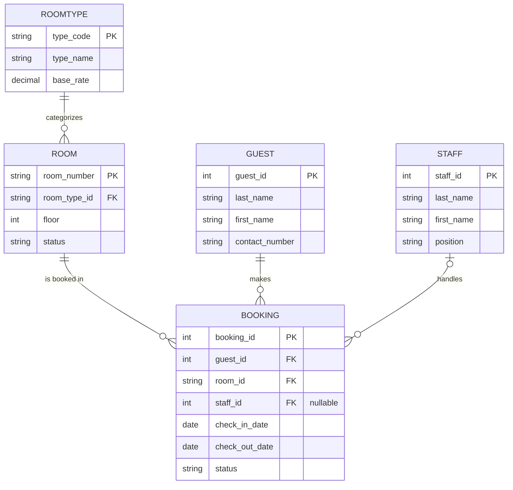

# CCINFOM DB App Sample Hotel Management System

> **What this is:** A sample/reference implementation of a CCINFOM Database Application
> Project (records management + transactions + reports on top of MySQL). This is **not**
> an official template from the department it's a worked example built to show one way
> of satisfying the proposal guidelines end-to-end, from schema design to a working
> front end with exportable reports.
>
> This README assumes **zero prior web development or Python experience.** If you've
> never run a Python project or touched a database before, you should still be able to
> follow this start to finish. Take it slow, run one command at a time, and read the
> "what this does" notes if a step doesn't make sense.
>
> Don't just copy the domain (hotel bookings) for your own group project the point is
> to see the *pattern* (core records -> transactions -> aggregated reports) so you can
> apply it to whatever your group actually chooses.

---

## Table of contents

- [A few concepts before you start](#a-few-concepts-before-you-start)
- [Stack](#stack)
- [Why this stack](#why-this-stack)
- [Project structure](#project-structure)
- [Database schema](#database-schema)
- [Setup & installation (step by step)](#setup--installation-step-by-step)
- [Running the project](#running-the-project)
- [Features implemented](#features-implemented)
- [How this maps to the proposal guidelines](#how-this-maps-to-the-proposal-guidelines)
- [Troubleshooting common errors](#troubleshooting-common-errors)
- [Known limitations](#known-limitations)

---

## A few concepts before you start

If any of these words are new to you, read this section first — it'll make the setup
steps much less confusing.

- **Python:** the programming language this whole project is written in. You need it
  installed on your computer before anything else works.
- **Django:** a "framework" (a big pre-written toolkit) for building web apps in
  Python. Instead of writing a website from scratch, Django gives you a lot of it for
  free — including an entire admin panel for managing database records.
- **MySQL / MariaDB:** the actual database software that stores your data on disk.
  MariaDB is basically MySQL with a different name (long story) — it's what this
  project uses locally since it's easier to install. Your course requires MySQL syntax,
  and MariaDB speaks the same language, so this works fine.
- **Virtual environment (venv):** a self-contained folder that holds a project's
  Python packages, separate from the rest of your computer. This avoids one project's
  dependencies breaking another project's dependencies. You'll create one before
  installing anything.
- **Environment variables / `.env` file:** instead of typing secrets (like your
  database password) directly into a Python file that gets committed to git, they're
  kept in a separate `.env` file on your own machine that git is told to ignore. Django
  reads that file on startup. You'll create your own `.env` in a later step.
- **Migration:** Django's way of turning your Python code (`models.py`) into actual
  SQL `CREATE TABLE` statements in your database. You write Python, Django writes the
  SQL for you.
- **Terminal / command line:** the black text-only window where you type commands.
  Every instruction below with a gray code box is something you type into the terminal
  and press Enter on.

---

## Stack

| Layer | Technology |
|---|---|
| Language | Python 3.10+ |
| Web framework | Django 6.0 |
| Database | MySQL / MariaDB |
| DB driver | `mysqlclient` |
| Config / secrets | `.env` file via `python-dotenv` |
| Records management UI | Django Admin (built-in, no code needed) |
| Custom UI (transactions, reports) | Django templates + Bootstrap 5 |
| Charts (in-browser) | Chart.js |
| Charts (in PDF) | Matplotlib (rendered server-side to an image) |
| PDF generation | xhtml2pdf |
| Package management | `pip` |
| Static type checking (optional, dev-only) | `mypy` + `django-stubs` |

## Why this stack

**Django, instead of writing everything from scratch:**
The DB App project is graded heavily on database design and how well the data is
represented to the user not on how much frontend code you personally hand-wrote.
Django Admin gives full CRUD (add/edit/delete/list/search/filter) for every table **for
free**, generated straight from the schema in `models.py`. That covers the entire
"records management" section of the proposal with almost no UI code, leaving more time
to get the schema and reporting logic right.

**MySQL/MariaDB:**
Required by the course. MariaDB was used locally since it's the actively maintained,
Arch-repo-available, drop-in-compatible option (`mysql` itself was pulled from Arch's
official package repos a while back MariaDB is the fork everyone uses instead).

**Bootstrap for custom pages:**
Transactions and reports need real logic Django Admin can't generate automatically
(multi-step booking/check-in/check-out flows, aggregated monthly reports). Bootstrap
gives these pages a clean, professional look without writing custom CSS from scratch.

**Matplotlib for PDF charts, Chart.js for in-browser charts:**
The PDF export tool (xhtml2pdf) can't run JavaScript, so the interactive Chart.js
graphs you see in the browser don't carry over into a downloaded PDF. Instead, charts
for PDF export are pre-drawn as image files (using Matplotlib, a Python charting
library) and embedded directly into the PDF like a picture.

## Project structure

```
hotel_system/
├── hotel/                      ← the main app (all the actual logic lives here)
│   ├── migrations/             ← auto-generated database schema history
│   ├── static/                 ← custom CSS and JS files
│   ├── templates/               ← HTML pages (dashboard, forms, reports, PDFs)
│   ├── templatetags/            ← custom template helper functions (e.g. currency formatting)
│   ├── models.py                 ← DATABASE SCHEMA — start reading here
│   ├── admin.py                  ← registers models with Django Admin (records UI)
│   ├── forms.py                  ← input forms for transactions
│   ├── views.py                  ← page logic: dashboard, transactions, reports
│   ├── reporting.py               ← report data calculation logic
│   ├── report_charts.py           ← Matplotlib chart generation for PDFs
│   ├── pdf_rendering.py           ← turns HTML templates into PDF files
│   └── urls.py                    ← maps URLs (like /reports/revenue/) to view functions
├── hotel_system/                 ← project-level configuration (not the app itself)
│   ├── settings.py               ← reads DB connection info / secrets from .env
│   └── urls.py                   ← top-level routing, includes hotel/urls.py
├── manage.py                     ← the command you run to do almost everything
├── seed_data.sql                 ← sample data to fill your database with
├── .env.example                   ← template for your local environment config
├── .env                            ← your actual local secrets — you create this,
│                                      it's gitignored and never committed (Setup step 7)
├── mypy.ini                        ← optional static type-checking config
├── requirements.txt               ← list of Python packages this project needs
└── requirements-dev.txt            ← adds mypy/django-stubs on top of requirements.txt
```

**If you only read one file to understand the whole system, read `models.py` first**
everything else exists to display, filter, or report on the data it defines.

## Database schema

5 tables, normalized to 3rd Normal Form (3NF):

- **RoomType** — `type_code (PK)`, `type_name`, `base_rate`
- **Room** — `room_number (PK)`, `room_type_id (FK → RoomType.type_code)`, `floor`, `status`
- **Guest** — `guest_id (PK)`, `last_name`, `first_name`, `contact_number`
- **Staff** — `staff_id (PK)`, `last_name`, `first_name`, `position`
- **Booking** — `booking_id (PK)`, `guest_id (FK)`, `room_id (FK)`, `staff_id (FK, nullable)`,
  `check_in_date`, `check_out_date`, `status`

### Entity-relationship diagram



Reading the diagram: `||` means "exactly one," `o{` means "zero or many," and `|o` means
"zero or one." So `ROOMTYPE ||--o{ ROOM` reads as "one RoomType categorizes zero or many
Rooms, and every Room belongs to exactly one RoomType." The `STAFF |o--o{ BOOKING` line
is the one exception a Booking is allowed to have **no** staff member attached
(`on_delete=SET_NULL` in `models.py`), so if a staff record is ever deleted, their past
bookings survive with `staff_id` set to `NULL` instead of being deleted too. Every other
foreign key uses `CASCADE` (delete the guest → their bookings go too) or `PROTECT`
(can't delete a RoomType while a Room still references it).

**Design notes (why it's shaped this way):**
- `base_rate` lives on `RoomType`, not on `Room` directly — this way, changing the
  Deluxe rate updates it everywhere at once instead of you having to hunt down every
  individual Deluxe room and edit it manually. Storing it per-room would have been a
  normalization violation (a "transitive dependency," if you've covered that term yet).
- `Booking` is the **transaction table** — it ties together Guest, Room, and Staff. It's
  intentionally separate from the "core record" tables, matching the distinction your
  proposal guidelines draw between records management and transactions.
- Revenue (`nights × rate`) is calculated live in report queries rather than saved as a
  permanent column on `Booking` — this avoids storing a number that could go stale if a
  room's rate changes after the booking was made.

## Setup & installation (step by step)

Go through these in order. Don't skip ahead even if a step looks optional.

### 1. Install Python

Check if you already have it:
```bash
python --version
```
You need 3.10 or newer. If you don't have Python, install it from
[python.org](https://python.org) (Windows/Mac) or via your package manager (Linux
e.g. `sudo pacman -S python` on Arch).

### 2. Install MySQL or MariaDB

- **Windows/Mac:** install MySQL Community Server from mysql.com, or MariaDB from
  mariadb.org.
- **Arch Linux:** `sudo pacman -S mariadb`, then:
  ```bash
  sudo mariadb-install-db --user=mysql --basedir=/usr --datadir=/var/lib/mysql
  sudo systemctl start mariadb
  sudo systemctl enable mariadb
  sudo mariadb-secure-installation
  ```
- **A GUI tool helps a lot as a beginner** install MySQL Workbench (or DBeaver) so you
  can see your tables and data visually instead of only through the terminal.

### 3. Create the database and a user

Log into MySQL/MariaDB:
```bash
sudo mariadb -u root -p
```
Then run:
```sql
CREATE DATABASE hotel_db;
CREATE USER 'hoteluser'@'localhost' IDENTIFIED BY 'yourpassword';
GRANT ALL PRIVILEGES ON hotel_db.* TO 'hoteluser'@'localhost';
FLUSH PRIVILEGES;
EXIT;
```
*(Replace `yourpassword` with something you'll remember — you'll put it in your `.env`
file in a later step.)*

### 4. Download this project

```bash
git clone https://github.com/AmaneKai/CCINFOM-DBAPP-SAMPLE.git
cd CCINFOM-DBAPP-SAMPLE/hotel_system
```
*(If you don't have `git`, you can also just download the project as a ZIP and extract
it.)*

### 5. Create a virtual environment

This keeps this project's Python packages separate from everything else on your
computer.
```bash
python -m venv .venv
```
Activate it **you have to do this every time you open a new terminal to work on this
project:**
- Mac/Linux: `source .venv/bin/activate`
- Windows (PowerShell): `.venv\Scripts\Activate.ps1`

You'll know it worked if you see `(.venv)` appear at the start of your terminal prompt.

### 6. Install the project's dependencies

```bash
pip install -r requirements.txt
```
This reads the `requirements.txt` file and installs every Python package this project
needs (Django, the MySQL driver, PDF/chart libraries, etc.) all at once.

> If `mysqlclient` fails to install, it's usually missing system-level build tools.
> - Arch: `sudo pacman -S mariadb-libs base-devel pkgconf`
> - Then retry `pip install -r requirements.txt`

### 7. Set up your environment file

Django reads its secret key, debug flag, and database credentials from a `.env` file
**not** from `settings.py` directly. This keeps your password out of git. Copy the
template and fill in your own values:

```bash
cp .env.example .env
```

Open `.env` in a text editor. It should match what you set up in step 3:
```
DJANGO_SECRET_KEY=pick-any-long-random-string-here
DJANGO_DEBUG=True
DJANGO_ALLOWED_HOSTS=

DB_ENGINE=django.db.backends.mysql
DB_NAME=hotel_db
DB_USER=hoteluser
DB_PASSWORD=yourpassword
DB_HOST=127.0.0.1
DB_PORT=3306
```
`.env` is listed in `.gitignore`, so it will never get committed only `.env.example`
(with placeholder values) is meant to be shared/committed.

### 8. Create the actual database tables

This is the step where Django reads `models.py` and turns it into real SQL tables:
```bash
python manage.py makemigrations
python manage.py migrate
```
If this finishes with no red error text, your tables now exist inside `hotel_db`. You
can double check by opening MySQL Workbench and looking for tables like
`hotel_room`, `hotel_guest`, etc.

### 9. Create a login for the admin panel

```bash
python manage.py createsuperuser
```
It'll ask for a username, an email (can be fake), and a password this is what you'll
use to log into `/admin/` later.

### 10. Fill the database with sample data

Open `seed_data.sql` in MySQL Workbench (or run it via the command line) against your
`hotel_db` database. This adds sample bookings plus rooms, guests, and staff so the
reports and dashboard actually have something to show instead of being empty.
```bash
mariadb -u hoteluser -p hotel_db < seed_data.sql
```

## Running the project

Every time you want to work on or view the project:

```bash
# 1. Activate your virtual environment first (see step 5 above)
source .venv/bin/activate    # or the Windows equivalent

# 2. Start the server
python manage.py runserver
```

You'll see a message saying it's running at `http://127.0.0.1:8000/`. Open that in your
browser. To stop the server, go back to the terminal and press `Ctrl+C`.

**Pages to try:**
- `http://127.0.0.1:8000/` — the main dashboard
- `http://127.0.0.1:8000/admin/` — the Django Admin panel (log in with the superuser
  account from step 9) — this is where records management (add/edit/delete rooms,
  guests, staff) lives
- `http://127.0.0.1:8000/booking/new/` — create a new booking (a transaction)
- `http://127.0.0.1:8000/reports/revenue/` — revenue report with a chart and PDF export
- `http://127.0.0.1:8000/reports/occupancy/` — occupancy report, same idea

## Features implemented

**Records management** (via Django Admin — zero custom code needed):
- Room, Guest, Staff, RoomType add / edit / delete / list for all four; Room and
  Guest additionally have filtering and search configured
- "View record with related records" e.g. opening a Room shows its Booking history
  inline

**Transactions** (multi-step operations touching several tables at once):
- Create booking / reservation
- Check-in
- Check-out (calculates the bill automatically)

**Reports** (both required to have a time filter per the proposal guidelines):
- Occupancy report monthly occupancy rate, month-over-month change, downloadable PDF
- Revenue report monthly revenue, month-over-month growth, year-over-year growth,
  downloadable PDF with an embedded chart

**Dashboard:**
- Summary cards at a glance (occupancy rate, revenue this month, average stay length,
  available rooms)
- Recent bookings list with one-click check-in/check-out buttons

## How this maps to the proposal guidelines

| Guideline requirement | Where it lives in this project |
|---|---|
| ≥2 core record tables, each with add/update/delete/view/list | Room, Guest, Staff (+RoomType) via Django Admin |
| "View record & related records" per table | Room's admin page shows its bookings inline |
| ≥2 transactions combining multiple records | Create booking, Check-in, Check-out |
| ≥2 reports with a time dimension, aggregated across records | Occupancy report, Revenue report (both monthly, with a year selector) |
| Minimum 10 records per table | Partially met by `seed_data.sql` see [Known limitations](#known-limitations) |
| 3-tier architecture | Presentation (templates / Admin) → Business logic (`views.py`, `reporting.py`) → Data (`models.py` + MySQL) |

## Troubleshooting common errors

**`AttributeError: module 'hotel.views' has no attribute '...'`**
Means `urls.py` is referencing a function that doesn't exist (or isn't spelled exactly
the same) in `views.py`. Open both files and make sure every function named in
`urls.py` actually exists in `views.py`.

**Server won't connect to the database / `OperationalError`**
- Is MySQL/MariaDB actually running? Check with `sudo systemctl status mariadb`
  (Linux) or check Services (Windows).
- Double-check the values in your `.env` file `DB_NAME`, `DB_USER`, `DB_PASSWORD`,
  `DB_HOST`, `DB_PORT` match exactly what you created in step 3.

**`KeyError` mentioning `DJANGO_SECRET_KEY` or a `DB_...` variable on startup**
Your `.env` file is missing, misnamed, or missing that specific key. Make sure you
copied `.env.example` to a file literally named `.env` in the same folder as
`manage.py` (step 7), and that every line from the template is still there.

**`mysqlclient` won't install**
You're missing system build tools, not a Python problem. See the note under step 6.

**Charts/reports show 0 or look empty**
Your seed data might not cover the month/year you're viewing. Check `seed_data.sql` —
it only has bookings for 2025 and part of 2026. Add more `INSERT` rows for other
months if you want fuller-looking charts.

**Nothing happens when you visit `localhost:8000` after starting the server**
Make sure the terminal still shows the server running (it should say
"Starting development server at..." and not have crashed). If it crashed, scroll up in
the terminal to read the actual error message — it'll usually tell you exactly which
file and line caused the problem.

## Known limitations

- **`RoomType` (3 rows) and `Staff` (5 rows) in `seed_data.sql` fall short of the
  "minimum 10 records per table" guideline.** `Room` (10), `Guest` (20), and `Booking`
  (61) all meet it. If your course grades on that literal count, add more room types
  and staff members to `seed_data.sql` before submitting this sample intentionally
  kept those two small because 10 realistic, distinct room *types* or job *positions*
  for one small hotel felt artificial, but pad them out if your rubric requires it.
- Seed data only spans 2025 to mid-2026; months without bookings will correctly show 0%
  occupancy / ₱0 revenue — that's expected, not a bug.
- PDF exports use "PHP" instead of the ₱ symbol due to font glyph limitations in the PDF
  rendering library.
- This is a solo-built sample, not a finished group submission assign your own core
  tables, transactions, and reports per member per your actual proposal requirements.
